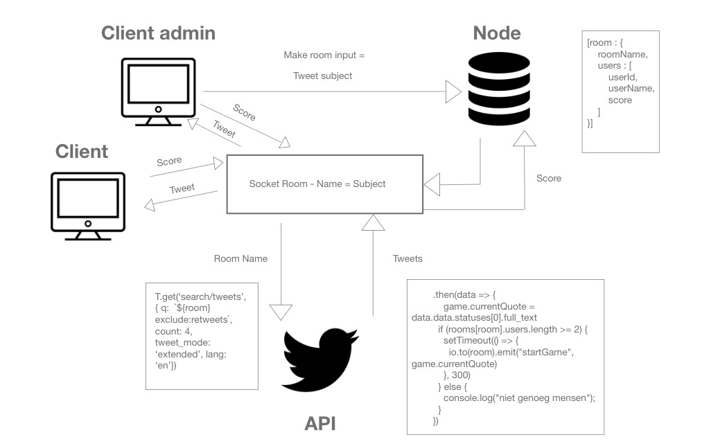

# Real-Time Web @cmda-minor-web · 2019-2020

## Introductie
Voor deze opdracht heb ik besloten een typing game te maken. Gebruikers komen op een "lobby" scherm waar ze een room kunnen aanmaken. De naam van de room zal de hashtagg zijn waarop gezocht kan worden. Er kunnen dus meerdere rooms worden aangemaakt. Als een persoon een room heeft aangemaakt zal er gevraagd worden of ze hun naam willen invoeren. Dit is de naam die beslist per ronde wie er gewonnen heeft en wie er uiteindelijk de winnaar is.

Als er minimaal 2 personen in een room zitten zal de game beginnen. De gebruikers krijgen een Tweet te zien gerelateerd aan het onderwerp waar de room is op gebasseerd en moeten dan zo snel mogelijk dit overtypen. De persoon die het eerste klaar is krijgt een punt. Nadat een persoon vijf punten heeft behaald is de game voorbij en wordt de winnaar getoond aan iedereen. Na een paar seconden wordt iedereen in de room terug gestuurd naar de lobby. 

## Table of Contents

- [Setup en installeren](#setup-and-installation)
- [API](#api)
- [Diagram](#diagram)
- [Mijn app](#my-app)
- [Features](#features)
- [License](#license)
- [Client to server events](#client-to-server-events)
- [Server to client events](#server-to-client-events)
- [Checklist](#checklist)
- [Wishlist](#wishlist)
- [License](#license)

## Setup en installeren
**1. Clone repository:**
```
git clone https://github.com/DesleyAalderink/real-time-web-1920.git
```
**2. Krijg alle dependencies:**
```json
{
  "dependencies": {
    "body-parser": "^1.18.3",
    "ejs": "^2.6.1",
    "express": "^4.17.1",
    "http": "0.0.0",
    "node-fetch": "^2.6.0",
    "socket.io": "^2.2.0",
    "twit": "^2.2.11"
  }
```
Run:
```
npm install
```

**3. Build en start server:**
```
nodemon app.js
```

**4. Open the app**
Ga naar [localhost:3400](localhost:3400) in je browser om de app te zien.

## API
Voor deze opdracht heb ik de Twitter API gebruikt. Om toegang tot deze API te krijgen heb je een developer account nodig. Dit is sneller bereikt dan je zou denken. Na het aanmaken van een developer account krijg je de nodige gegevens om je applicatie hiermee te koppelen. Dat zijn: 

- consumer_key
- consumer_secret
- access_token
- access_token_secret

## Diagram



## Features
- Gebruikers kunnen rooms aanmaken
- Er is geen limiet van hoeveel mensen in een room kunnen
- Gebruikers bepalen zelf wat het onderwerp van de room is
- Het onderwerp is waar de Tweet op wordt gezocht
- Typing game

## Client to server events
* `'new-user'` // Wanneer een gebruiker zijn naam heeft opgegeven wordt deze opgeslagen samen met een score van 0 en de socket.id
* `'initiate game'` // Wanneer er genoeg gebruikers zijn wordt deze gevuurd. De API call wordt gemaakt en de Tweet wordt opgehaald.
* `'score'` // Wanneer iemand de Tweet succesvol heeft overgetypt zal deze geactiveerd worden. Er wordt gekeken wie er heeft gescoord en als de punten aantal 6 is zal de game eindigen.

## Server to client events
* `'roundUpdate'` // Houdt de rondes bij per room.
* `'room-created'` // Wanneer een room wordt aangemaakt zal dit worden verstuurd naar de server.
* `'startGame'` // Wanneer een room wordt aangemaakt zal dit worden verstuurd naar de server. De waiting room message zal weggehaald worden en de input velden komen tevoorschijn.
* `'roundOver'` // Wanneer iemand gescoord heeft is een ronde voorbij en zal iedereen zie wie de ronde gewonnen heeft.
* `'gameOver'` // Als een gebruiker in totaal 6 punten heeft bereikt zal de game eindigen en wordt iedereen terug in de lobby gezet.

## Checklist
- [x] Rooms aanmaken
- [x] Users bepalen zelf waar Twitter op zoekt
- [x] Meerdere gebruikers in meerdere rooms
- [x] Gebruikers moeten de Tweet succesvol overtypen en krijgen hier feedback van
- [x] Gebruikers krijgen punten per ronde
- [x] Een uiteindelijke winnaar wordt bepaald en iedereen wordt teruggezet in de lobby

### Wishlist
* Concept veranderen naar: gebruikers moeten de Tweet raden die komt

## License
[MIT](LICENSE) © [Desley Aalderink](https://github.com/DesleyAalderink)
